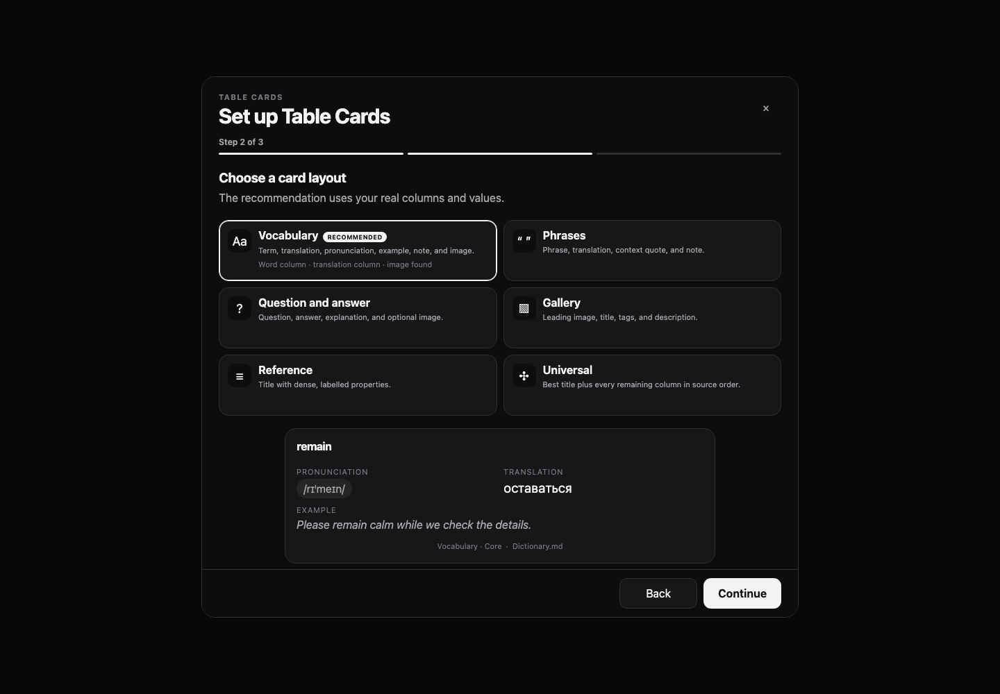
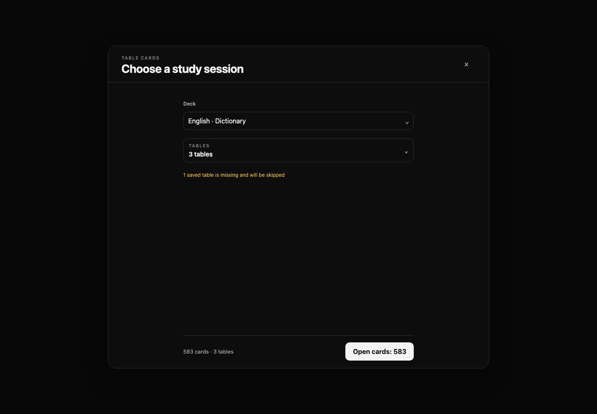
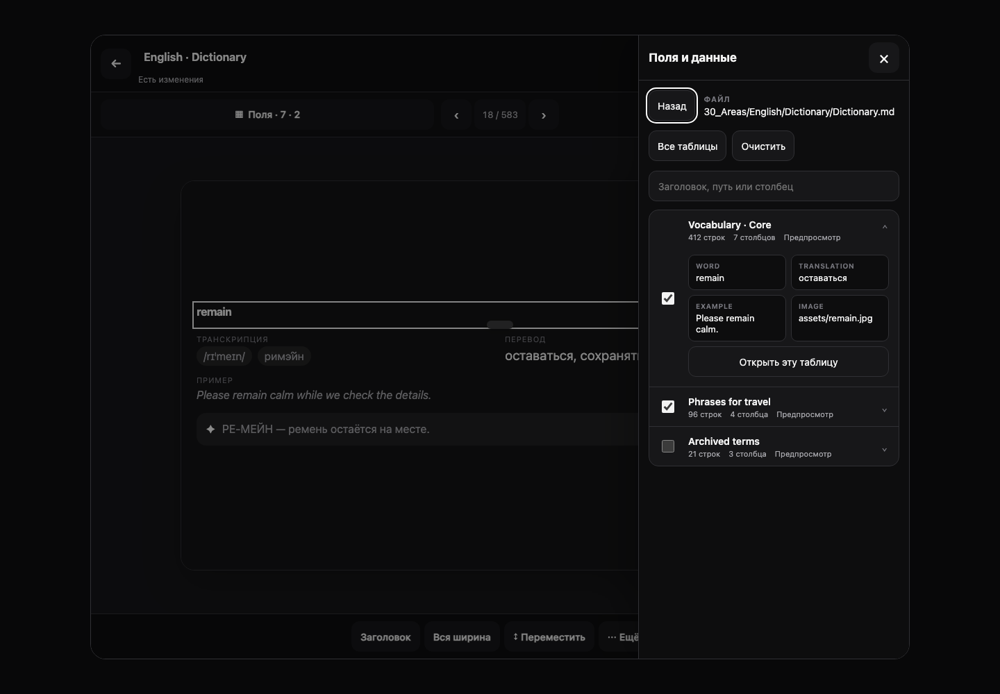
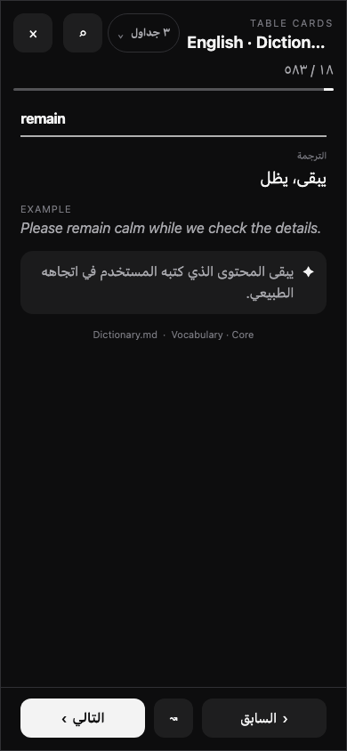

# Table Cards

<!-- markdownlint-disable MD013 -->

Turn Markdown tables into focused, all-visible study cards inside Obsidian. Table Cards is local-first, leaves source notes untouched, and uses the same monochrome workflow on desktop and phone.



## What it does

- Builds one deck from any mix of notes, folders, and individual tables.
- Opens every session through a mandatory launcher, so the deck, tables, and valid card count are explicit before study starts.
- Shows every enabled card block immediately—there is no front/back reveal state.
- Searches every cell in the active scope and opens the exact matching source row as a card.
- Provides a visual, draft-based layout editor with desktop and phone previews.
- Works without telemetry, runtime translation, or an application network client.

## Install

Copy these three release artifacts into `.obsidian/plugins/table-cards/` in your vault:

```text
main.js
manifest.json
styles.css
```

Then enable **Table Cards** in **Settings → Community plugins**. User settings live separately in `data.json`; the deploy script copies only the three runtime artifacts above.

## First run

A fresh install opens a three-step setup wizard:

1. **Data** — add one or more Markdown notes or folders, then choose all tables or an explicit subset.
2. **Preset** — compare six layouts against a real representative row. The scorer recommends one from **Vocabulary**, **Phrases**, **Question and answer**, **Gallery**, **Reference**, and **Universal**.
3. **Finish** — name the deck, choose a ribbon icon, and decide whether to show the deck in Obsidian's left ribbon.

The wizard is deliberately compact; every preset produces ordinary editable blocks rather than a separate rendering mode. To run it again, use **Create deck with setup** in the command palette or the same action in **Settings → Table Cards**. Existing decks are not replaced.

## Start a study session

Run **Open cards** for the general launcher. Pick a deck, review its remembered table scope, and confirm **Open N cards**. Clearing every table disables the start action.

A deck-specific ribbon button opens the same launcher with that deck locked. It still stops for table selection and confirmation—ribbon buttons never bypass the launcher.



During study:

- use Previous/Next, `←`/`→`, or a horizontal swipe;
- press `S` to toggle shuffle;
- select the scope chip to change tables without rescanning the vault;
- open the card browser to search all active table cells;
- choose a result to open that exact card with its file, table label, and row context;
- tap an enabled image to zoom it.

The source line under each card stays secondary and uses the human table heading plus file name.

## Visual editor

Open **Settings → Table Cards → Edit layout**.

- **Sources** — add notes or folders, see each source's compact selection summary, and enter a focused multi-table route with search, all/none actions, row previews, and **Open this table**.
- **Fields** — inspect inferred types, fill rates, examples, and warnings; type overrides remain deck-specific.
- **Canvas** — select rendered blocks directly. Drag on desktop or use accessible move actions on touch and keyboard.
- **Block** — configure columns, kind, label, width, phone density, height, overflow, empty values, image behavior, colors, border, and alignment.
- **Card style** — use Obsidian, monochrome, or custom colors and tune spacing, type scale, radius, border, shadow, and maximum width.

Source selection, automatic layout, and visual changes remain one local draft until **Save**. Undo/redo and `Cmd/Ctrl+Z` work inside the editor; `Cmd/Ctrl+S` saves. Closing a dirty editor offers Save, Discard, or Continue editing.



## Data, empty cells, and images

Columns are detected as text, number, date, boolean, tags, link, Markdown, image, or mixed. Each block can hide an empty value, show a dash or custom text, preserve space, fall back to another column, or skip the complete row when required.

Obsidian embeds such as `![[image.png|300x200]]` and Markdown images are supported. Image blocks provide contain/cover, aspect ratio, crop focus, captions, missing-file state, and optional tap-to-zoom. Local files resolve through the vault. A remote URL already present in source Markdown is passed to the standard image element; Table Cards itself adds no image service or network client.

## Phone, keyboard, and RTL

Phone uses one card column, full-height selection/browser sheets, safe-area-aware footers, and controls at least 44×44 CSS px. Long content stays inside the card or its configured scrolling block and never creates document-level horizontal overflow. Reduced-motion preferences remove interface transitions.

The UI supports English, Russian, Ukrainian, Spanish, German, French, Brazilian Portuguese, Italian, Polish, Turkish, Simplified Chinese, Traditional Chinese, Japanese, Korean, Arabic, and Hindi. Automatic mode follows Obsidian's locale; manual selection uses native language names. Arabic mirrors only Table Cards chrome. User-authored table content keeps `dir="auto"` and its natural direction.



## Migration and privacy

Schema-v1 and schema-v2 settings migrate idempotently to schema v3. Deck IDs, file/folder sources, selected table, block order and visibility, appearance overrides, progress, shuffle seed, locale, and the last active deck are preserved. Migrated users are not interrupted by first-run setup.

Table Cards never rewrites Markdown tables or inserts hidden row IDs. Cards and source identities are derived in memory from the vault content. There is no telemetry, cloud sync, runtime translation, or remote content processing.

## Intentional limits

- No external deep links to a Markdown row, because rows have no stable native ID.
- No spaced repetition, scoring, or statistics.
- No editing of Markdown cells from a card.
- The browser mounts at most 100 matches while still reporting the full result count.

## Architecture and development

The plugin is TypeScript with small boundaries for table scanning/cataloguing, scope/search state, setup presets, typed i18n catalogs, launcher/study coordination, and editor routes. English is the canonical translation contract; all 16 catalogs are checked for exact key parity. Runtime code uses public Obsidian APIs and contains no Node or Electron import.

```bash
npm install
npm test
npm run lint
npx tsc --noEmit
npm run build
npx playwright install chromium
npm run test:ui
```

`npx playwright install chromium` is a one-time browser setup for a clean checkout. Deterministic production-class fixtures live in `preview/launcher.html`, `preview/setup.html`, `preview/v2.html`, and `preview/editor.html`. The Playwright gate covers desktop, tablet, zoom-equivalent, phone, Arabic RTL, reduced motion, focus restoration, target geometry, overflow, and console output.

See the [changelog](CHANGELOG.md) and [UX/accessibility audit](docs/ux-audit-2026-08-18.md). Version `0.1.0` is the first complete release and already uses the schema-v3 product model; schema version and package version are intentionally independent.
